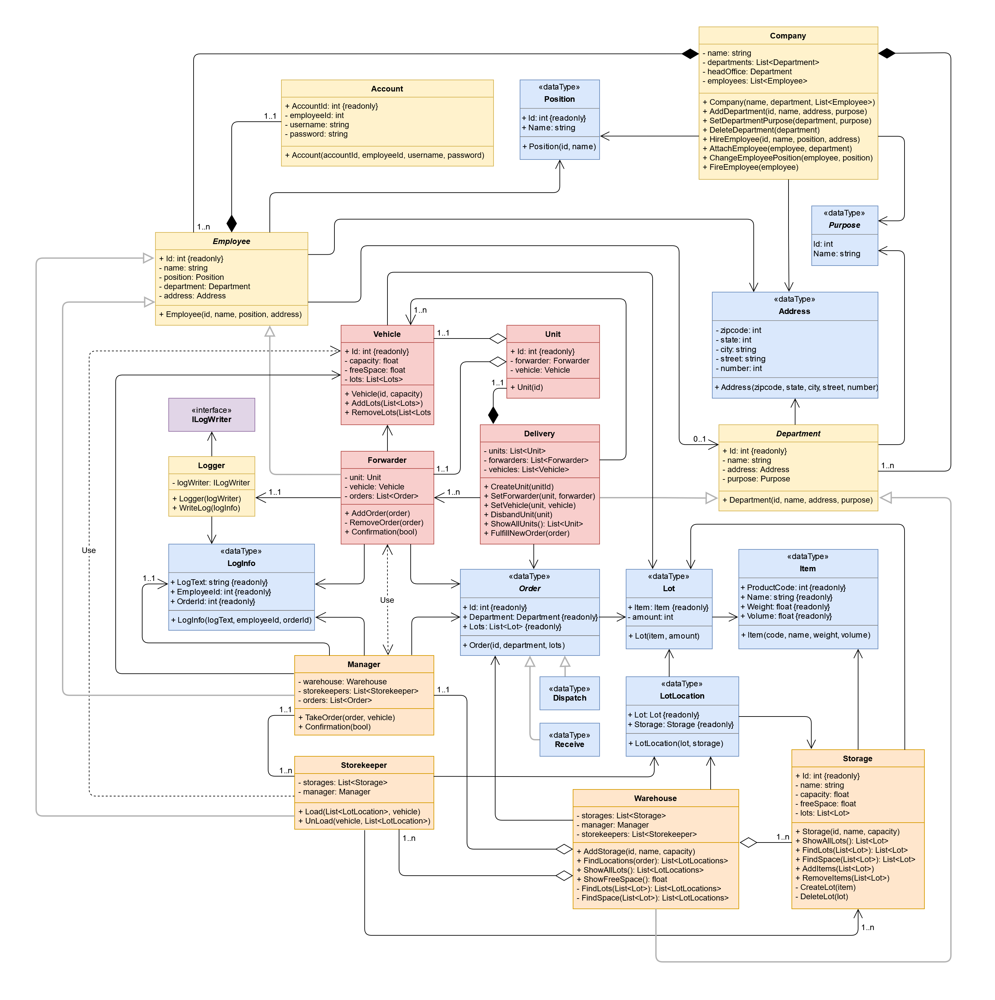

# Decompose Warehouse

The repository contains my work on self-completion of a study Task 
while taking specialized online courses for training C# developers.

An experienced Mentor checked the result and made his remarks on 
the quality of the work performed. The Task could not be completed 
until the Mentor decided that the result was up to industry standards.

The commit called “First implementation of the Task” is my original 
implementation, without any hints. All subsequent commits (if any) 
are the results of my attempts to solve Mentor's remarks and his 
suggestions for improvement the work.

According to the conditions of the school, the Mentor does not provide 
ways to solve shortcomings and sources of information. The search for 
the necessary educational information was carried out independently.
  

## Task Conditions

Analyze and decompose Warehouse (create UML class diagram for application).
  
The user of your application will be a Warehouse manager.
  
Analyze main parts and functions or Warehouse.
  
Result should be added to the separate repository.
  

## Result image

## Usage of the source file

Clone the remote repository on your local machine. 
`$ git clone https://github.com/Shkurlatov/Decompose-Warehouse.git`
  
Open in your browser a special online resource for viewing and editing diagrams. 
https://app.diagrams.net/
  
In the appeared window select Device option.
  
In the Device window select Open Existing Diagram.
  
In the Explorer window choose the Warehouse.drawio file from the clonned repository.